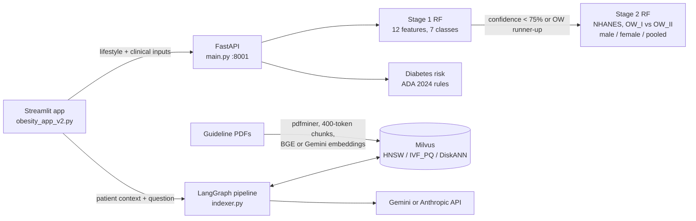

# Leakage-Free Obesity Risk Classifier with RAG Guidance

Two-stage obesity risk screening from plain-language lifestyle questions, with borderline cases escalated to an NHANES-trained clinical model and citation-grounded nutrition guidance from a Milvus + LangGraph RAG pipeline.

 

## What it does

- **Stage 1 (lifestyle model):** a Random Forest predicts one of 7 WHO weight classes from 11 self-reported answers (diet, activity, screen time, family history, and a coarse BMI bucket instead of exact height/weight). Exact BMI is excluded because it is an algebraic leak of the label (BMI defines the WHO class); the shipped bundle uses a lean 12-feature set trained on the UCI dataset (n=2,111).
- **Composite confidence score:** combines centroid cosine similarity, model probability, a confusion-risk penalty from runner-up centroids, and demographic alignment, with weights tuned on out-of-fold predictions.
- **Stage 2 (clinical model):** when Stage 1 lands on Overweight I/II with low confidence or an Overweight runner-up, a gender-specific Random Forest on 40 NHANES 2021-2023 features (waist, blood pressure, glucose, insulin/HOMA-IR, liver and kidney panel) refines the call (trained on n=2,289 fasting adults; male, female, and pooled bundles).
- **Diabetes risk:** rule-based scoring against ADA 2024 thresholds (fasting glucose, HbA1c, HOMA-IR).
- **RAG nutrition chat:** the prediction is serialized as patient context and passed to a LangGraph pipeline (translate, retrieve from Milvus, generate, reflect, revise up to 2x) over 14 clinical guideline PDFs, with Gemini or the Anthropic API as the LLM.

## Architecture



The FastAPI service owns both classifiers and the diabetes rules; it loads the Stage 1 bundle at startup and the Stage 2 bundles lazily by gender. The Streamlit app calls the API for assessment and runs the RAG pipeline in-process against Milvus. The assessment path needs no API keys or Milvus; only the Nutrition Plan and Index PDFs tabs do. Design rationale for every component is in [docs/METHODS.md](docs/METHODS.md).

## Quickstart

```bash
git clone https://github.com/DevSoVague/obesity-risk-rag.git
cd obesity-risk-rag
python3.11 -m venv .venv && source .venv/bin/activate
pip install -r requirements.txt          # sentence-transformers pulls in torch
```

Download the pre-trained model bundles from the [GitHub Release](https://github.com/DevSoVague/obesity-risk-rag/releases/latest) (they are not in git):

| File | Size | Put it in |
|---|---|---|
| `obesity_model_bundle.joblib` | 25.7 MB | `app/` |
| `model2_pooled_bundle.joblib` | 5.0 MB | `app/model2_bundles/` |
| `model2_male_bundle.joblib` | 2.6 MB | `app/model2_bundles/` |
| `model2_female_bundle.joblib` | 2.8 MB | `app/model2_bundles/` |

```bash
BASE=https://github.com/DevSoVague/obesity-risk-rag/releases/latest/download
curl -L -o app/obesity_model_bundle.joblib $BASE/obesity_model_bundle.joblib
for g in pooled male female; do
  curl -L -o app/model2_bundles/model2_${g}_bundle.joblib $BASE/model2_${g}_bundle.joblib
done
```

Run (all commands from `app/`, since bundle paths are relative):

```bash
cd app
uvicorn main:app --port 8001                 # API, docs at http://localhost:8001/docs
streamlit run obesity_app_v2.py              # second terminal, UI at http://localhost:8501
```

For the RAG tabs, also start Milvus (`docker compose up -d` with the [Milvus standalone compose file](https://milvus.io/docs/install_standalone-docker-compose.md)). Configuration is read from environment variables only (all optional; the assessment path needs none):

- `GEMINI_API_KEY`: Gemini generation, embeddings, and web search (`GOOGLE_API_KEY` is mirrored from it)
- `ANTHROPIC_API_KEY`: Anthropic API backend for RAG generation
- `MILVUS_URI`, `MILVUS_TOKEN`, `MILVUS_COLLECTION`: Milvus connection (defaults to local `http://localhost:19530`)
- `OBESITY_API_URL`: FastAPI address used by Streamlit (default `http://localhost:8001`)
- `MODEL2_BUNDLE_DIR`: Stage 2 bundle folder (default `model2_bundles`)
- `TRANSLATOR_URL`: optional external translator service (falls back to Gemini)

Quick API check:

```bash
curl -X POST localhost:8001/predict -H "Content-Type: application/json" \
  -d '{"gender":1,"age":25,"family_history":1,"fcvc":2,"ncp":3,"caec":1,"ch2o":2,"faf":1,"tue":1,"calc":1,"bmi_bucket":2}'
```

## Data

No data is committed. Everything used is public:

- **UCI Estimation of Obesity Levels** (2,111 records, 7 classes, partly SMOTE-synthetic): [archive.ics.uci.edu/dataset/544](https://archive.ics.uci.edu/dataset/544/estimation+of+obesity+levels+based+on+eating+habits+and+physical+condition). Used by `app/model_pipeline.py` and notebook 00.
- **NHANES August 2021 - August 2023** (CDC, files with suffix `_L`): `DEMO_L`; exam `BMX_L`, `BPXO_L`, `BAX_L`; lab `BIOPRO_L`, `GHB_L`, `GLU_L`, `INS_L`, `TCHOL_L`; questionnaire `ALQ_L`, `BAQ_L`, `BPQ_L`, `DIQ_L`, `HSQ_L`, `KIQ_U_L`, `MCQ_L`, `PAQ_L`, `SLQ_L`, `SMQ_L`, `WHQ_L`. From [wwwn.cdc.gov/nchs/nhanes](https://wwwn.cdc.gov/nchs/nhanes/continuousnhanes/default.aspx?Cycle=2021-2023).
- **Clinical guideline PDFs** for the RAG index are copyrighted and not redistributed: [docs/sources.md](docs/sources.md) lists all 14 with citations. Download them into `pdfs/` and upload them in the Index PDFs tab.

`bash scripts/download_data.sh` fetches the UCI CSV (into `app/` and `notebooks/`) and all NHANES XPT files (into `notebooks/<domain>_data/`). Notebooks 01 and 02 build `notebooks/merged_data/ow_*fasting_clean.csv`; copy those into `app/merged_data/` to rerun `app/resave_bundles.py`. `cd app && python model_pipeline.py` retrains Stage 1.

## Project structure

```
obesity-risk-rag/
├── app/
│   ├── main.py                  # FastAPI: /predict, /predict/full, /health, /features, ...
│   ├── model_pipeline.py        # Stage 1 training, confidence score, Stage 2 router, diabetes rules
│   ├── obesity_app_v2.py        # Streamlit UI (Assessment, Nutrition Plan, Index PDFs)
│   ├── indexer.py               # PDF ingestion, Milvus, LangGraph RAG
│   ├── resave_bundles.py        # retrains the three Stage 2 bundles
│   ├── obesity_rf_metadata.json
│   └── model2_bundles/model2_metadata.json
├── notebooks/
│   ├── 00_model1_development.ipynb          # Stage 1 EDA, leakage study, tuning
│   ├── 01_nhanes_merge.ipynb                # merge NHANES XPT files
│   ├── 02_nhanes_cohort_and_features.ipynb  # cohort filters, feature engineering, gender split
│   └── 03_model2_training.ipynb             # Stage 2 training and evaluation
├── docs/                        # METHODS.md, NHANES_MODEL2_ANALYSIS.md, sources.md
├── scripts/download_data.sh
├── requirements.txt, requirements-notebooks.txt
└── LICENSE
```

## Team & credits

Solo project by Devavrath Sandeep for Machine Learning in Biomedical Engineering, Carnegie Mellon University (Spring 2026). Data: UCI Machine Learning Repository and CDC NHANES. Embeddings: `BAAI/bge-large-en-v1.5`.

This is a course project, not a medical device. Its outputs are not diagnoses.

## License

MIT, see [LICENSE](LICENSE). Downloaded datasets and guideline PDFs keep their own licenses.
